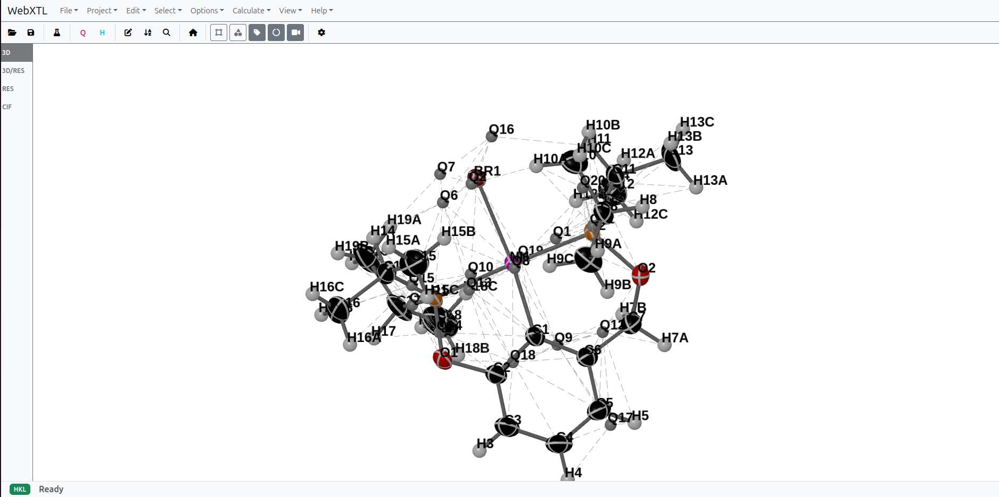
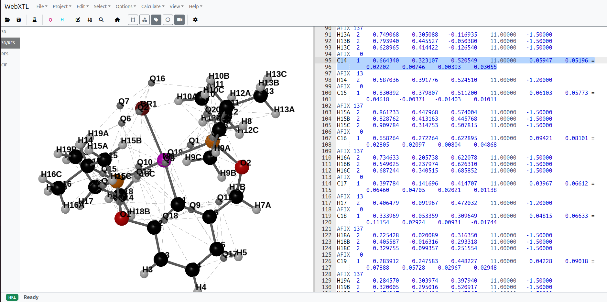
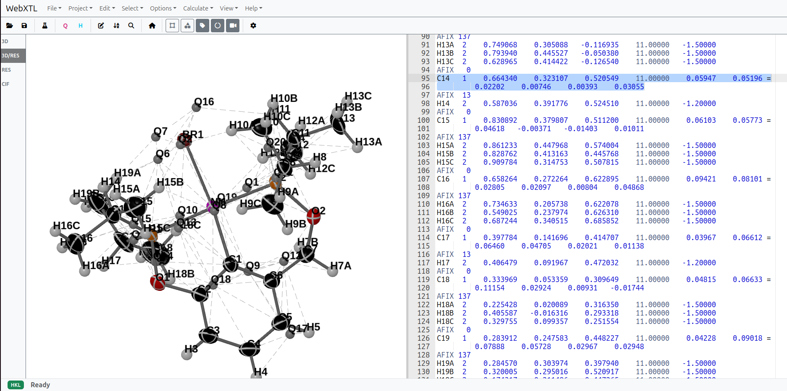

# WebXTL

**Advanced Web-Based Shelxl Viewer and Editor**



WebXTL is a powerful, modern web application designed for crystallographers. It provides a seamless environment for visualizing molecular structures, editing crystallographic data files (.res, .ins, .cif, .pdb), and managing refinement projects—all within the browser.

## Key Features

### 📂 File Support
-   **Core Formats**: Full support for reading and editing **.res**, **.ins**, **.cif**, **.pdb**, and **.hkl** files.
-   **Project Management**: Server-side project loading, saving, and backup management.
-   **Smart Drag & Drop**: Drag files directly into the browser to load them instantly.

### 🖥️ Interface & Visualization
-   **Dual-Pane Workspace**: 
    -   **Split View**: Simultaneously view the 3D structure and the underlying code (RES/INS/CIF).
    
    

    -   **Resizable Panes**: Adjustable split-grid layout for customized workflows.
-   **High-Performance 3D Viewer**:
    -   **Rendering**: Atoms, bonds, unit cell, and ADPs (Anisotropic Displacement Parameters) rendered using Three.js.
    
    

    -   **View Controls**: Toggle Unit Cell, Labels, Perspective/Orthographic projection.
    -   **Interaction**: Click atoms to select them in the editor.

### 📝 Advanced Editor
-   **Syntax Highlighting**: Custom Ace Editor modes for **SHELX** and **CIF** formats.
-   **Command Autocompletion**: Intelligent suggestions for SHELX keywords.
-   **Editor Tools**:
    -   **Search & Replace**: Standard Ctrl+F functionality.
    -   **Duplicate Text**: Ctrl+D.
    -   **Add Trailer**: Alt+T for appending text to lines.
    -   **Comment/Uncomment**: Ctrl+/ toggling.

### 🛠️ Crystallographic Tools
WebXTL includes a suite of specialized tools for structure refinement:

**Atom Management**
-   **Kill Q Peaks**: Instantly remove Q-peaks (Ctrl-K).
-   **Kill H Atoms**: Remove Hydrogen atoms (Ctrl-Shift-K).
-   **Relabel Atoms**: Automatically renumber/rename atoms (Ctrl-L).
-   **Sort Atoms**: Smart sorting (Alt-S) that preserves "riding" atoms (Hydrogens, AFIX groups) and maintains file structure (headers/footers).
-   **Find Duplicates**: Detect duplicate atom labels (Alt-D).

**Structure Options**
-   **HFIX / Auto HFIX**: Add Hydrogen fixation instructions manually or automatically for Carbons (Ctrl-H).
-   **Isotropic / U(iso)**: Convert atoms to isotropic or change U(iso) values (Ctrl-I).
-   **Formula**: Calculate and correct molecular formula based on atom counts.
-   **Omit Error**: Remove atoms with ESD error flags.
-   **Calculate DISP**: Compute dispersion corrections.
-   **Assign Q as C**: Quickly convert Q-peaks to Carbon atoms.

### ⚙️ Refinement Integration
-   **Refine Structure**: Trigger refinement processes directly from the toolbar (requires backend configuration).
-   **Symmetry & Unit Cell**: Visual toggles for unit cell boundaries and symmetry elements.

## Installation & Development

1.  **Clone the Repository**
    ```bash
    git clone https://github.com/dspasyuk/WebXTL.git
    cd WebXTL
    ```

2.  **Install Dependencies**
    ```bash
    npm install
    ```

3.  **Run in Development Mode**
    Start the Vite development server with hot-reload:
    ```bash
    npm run dev
    ```

4.  **Build for Production**
    Compile the application for deployment:
    ```bash
    npm run build
    ```

5.  **Run Production Server**
    Start the Node.js backend to serve the app and handle project requests:
    ```bash
    node server.js
    ```

## Technologies
-   **Frontend**: HTML5, CSS3, JavaScript (ES6+), Bootstrap 5
-   **Build System**: Vite (supports HMR and optimized builds)
-   **Visualization**: Three.js
-   **Code Editing**: Ace Editor
-   **Layout**: Split-Grid (CSS Grid compatible)
-   **Backend**: Node.js / Express

## License
MIT License. See `package.json` for details.
