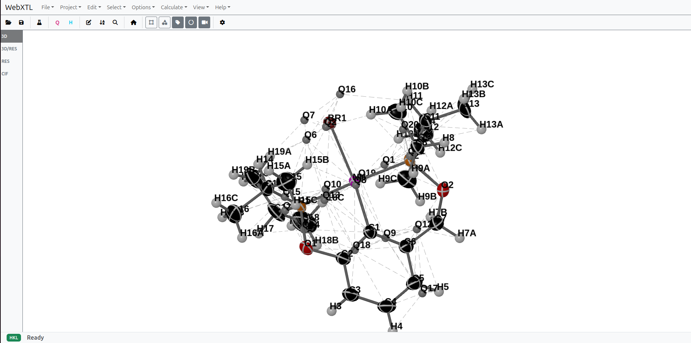
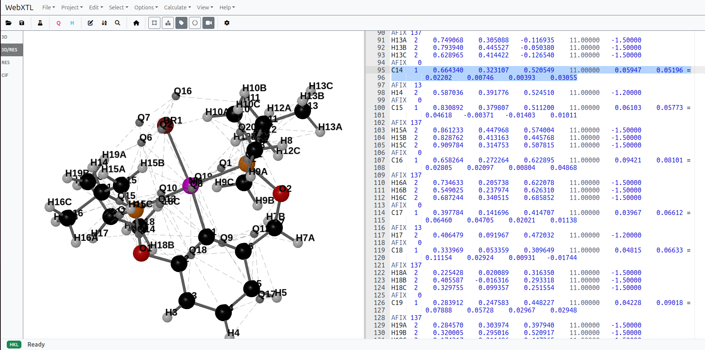
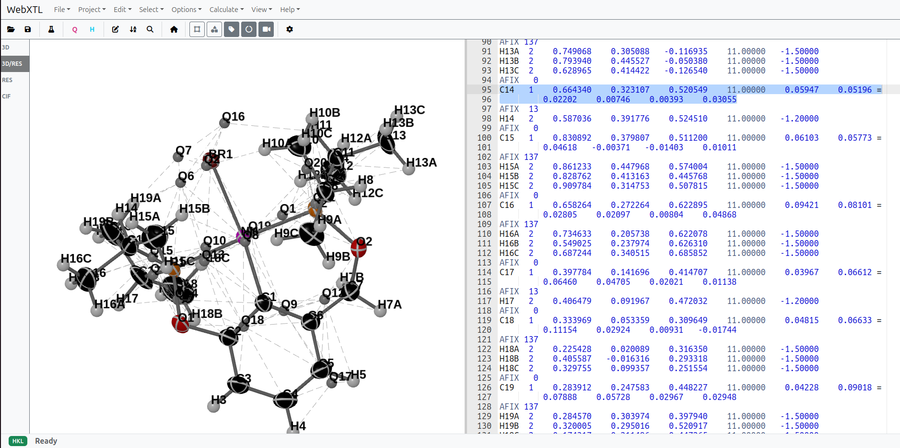

# WebXTL

**Advanced Web-Based Shelxl Viewer and Editor**



WebXTL is a powerful, modern web application designed for crystallographers. It provides a seamless environment for visualizing molecular structures, editing crystallographic data files (.res, .ins, .cif, .pdb), and managing refinement projects—all within the browser.

## Key Features

### 📂 File Support
-   **Core Formats**: Full support for reading and editing **.res**, **.ins**, **.cif**, **.pdb**, and **.hkl** files.
-   **Project Management**: Server-side project loading, saving, and backup management.
-   **Smart Drag & Drop**: Drag files directly into the browser to load them instantly.

### 🖥️ Interface & Visualization
-   **Dual-Pane Workspace**: 
    -   **Split View**: Simultaneously view the 3D structure and the underlying code (RES/INS/CIF).
    
    

    -   **Resizable Panes**: Adjustable split-grid layout for customized workflows.
-   **High-Performance 3D Viewer**:
    -   **Rendering**: Atoms, bonds, unit cell, and ADPs (Anisotropic Displacement Parameters) rendered using Three.js.
    
    

    -   **View Controls**: Toggle Unit Cell, Labels, Perspective/Orthographic projection.
    -   **Interaction**: Click atoms to select them in the editor.

### 📝 Advanced Editor
-   **Syntax Highlighting**: Custom Ace Editor modes for **SHELX** and **CIF** formats.
-   **Command Autocompletion**: Intelligent suggestions for SHELX keywords.
-   **Editor Tools**:
    -   **Search & Replace**: Standard Ctrl+F functionality.
    -   **Duplicate Text**: Ctrl+D.
    -   **Add Trailer**: Alt+T for appending text to lines.
    -   **Comment/Uncomment**: Ctrl+/ toggling.

### 🛠️ Crystallographic Tools
WebXTL includes a suite of specialized tools for structure refinement:

**Atom Management**
-   **Kill Q Peaks**: Instantly remove Q-peaks (Ctrl-K).
-   **Kill H Atoms**: Remove Hydrogen atoms (Ctrl-Shift-K).
-   **Relabel Atoms**: Automatically renumber/rename atoms (Ctrl-L).
-   **Sort Atoms**: Smart sorting (Alt-S) that preserves "riding" atoms (Hydrogens, AFIX groups) and maintains file structure (headers/footers).
-   **Find Duplicates**: Detect duplicate atom labels (Alt-D).

**Structure Options**
-   **HFIX / Auto HFIX**: Add Hydrogen fixation instructions manually or automatically for Carbons (Ctrl-H).
-   **Isotropic / U(iso)**: Convert atoms to isotropic or change U(iso) values (Ctrl-I).
-   **Formula**: Calculate and correct molecular formula based on atom counts.
-   **Omit Error**: Remove atoms with ESD error flags.
-   **Calculate DISP**: Compute dispersion corrections.
-   **Assign Q as C**: Quickly convert Q-peaks to Carbon atoms.

### ⚙️ Refinement Integration
-   **Refine Structure**: Trigger refinement processes directly from the toolbar (requires backend configuration).
-   **Weight (GOOF) Refinement**: Automatically optimize the WGHT instruction over multiple SHELXL cycles to drive the goodness-of-fit toward 1 (menu: Refine → Weight (GOOF)).
-   **Refinement Summary**: After refinement, key statistics (R1, wR2, GooF, diff. peak/hole, etc.) are parsed from the `.lst` and displayed in a summary panel.
-   **Symmetry & Unit Cell**: Visual toggles for unit cell boundaries and symmetry elements.

### 📤 Publish Tools
-   **Create Publish CIF**: Generate a publication-ready CIF by combining a user/author template (`data_global` block with author, references, abstract) with an instrument/device template that overrides per-value device settings (e.g. diffractometer, wavelength).
-   **Crystallographic Report (DOCX)**: One-click generation of a formatted Word report containing crystal data and refinement tables, atomic coordinates, bond lengths/angles, and hydrogen bonds.

### 🖥️ Server & Backend Architecture
WebXTL is powered by a robust Node.js/Express backend that handles heavy lifting for crystallography tasks:

**Structure Refinement Engine**
-   **Native SHELXL Integration**: The server spawns a real `shelxl` process to perform least-squares refinement (`POST /refine`).
-   **Process Management**: Handles execution, captures standard output/error logs, and returns the refined structure (`.res`) and listing (`.lst`) files to the frontend.
-   **Requirement**: The `shelxl` executable must be installed and accessible in the system PATH.

**External Crystallography Programs**
-   The server can run the installed **SHELX** suite: **SHELXL**, **SHELXS**, **SHELXT**, **SHELXD**, **SHELXH**, **SHELXE**, **SHELXC** (`POST /run/:program`).
-   **Automatic Detection**: At startup the server scans the system `PATH`; only programs whose executables are actually installed are exposed to the client (`GET /programs`) and shown in the **Programs** menu.
-   **Generic Runner**: Uploads structure files to an isolated project directory, backs up existing files, spawns the program non-interactively, and returns produced output files (including suffixed outputs such as SHELXT's `name_a.res`) plus captured stdout/stderr.
-   **Requirement**: Programs must be installed and accessible in the system PATH.

**jsSpace — Built-in Space-Group Determination (XPREP alternative)**
-   A pure-JavaScript space-group determination engine (`src/js/jsSpace/`) that runs on the server with no external dependencies, usable both from the command line and the UI.
-   **HKL Parsing**: Reads **XDS_ASCII.HKL** (headers, unit cell, wavelength) and standard **SHELX** five-column HKL files.
-   **Analysis**: Determines the crystal system from the unit-cell metric, the Laue class from R(sym) merging across all eleven Laue groups, the lattice centering (P/A/B/C/I/F/R) from reflection conditions, and ranks space-group candidates by systematic absences (screw axes and glide planes) plus a Wilson-style centrosymmetry test.
-   **Corrected/Merged HKL Output**: Merges the reflections under the chosen Laue group (weighted mean intensities, scatter-aware sigmas) and writes:
    - a **SHELX five-column HKL file** ready for **SHELXD / SHELXT / SHELXS** (verified end-to-end with SHELXT), and
    - a **merged XDS_ASCII** file (`MERGE=TRUE`), plus
    - a **POINTLESS-style merging report** (R(merge), R(meas), R(pim), completeness, multiplicity, mean I/σ).
-   **Force a Space Group**: Override the automatic determination by pinning a specific space group — by number or Hermann-Mauguin symbol (e.g. `14`, `P 21/c`, `P-1`). jsSpace then merges under that group's Laue class, labels the output with the forced space group, and reports whether it is consistent with the data (`violations`) alongside the automatically-determined group.
-   **Missing Unit Cell**: When an HKL file carries no cell parameters, jsSpace asks for them (CLI prompt or UI dialog).
-   **CLI**: `node src/js/jsSpace/cli.js <file.hkl> [--cell "a b c alpha beta gamma"] [--space-group "14" | "P 21/c"]` — writes `<basename>_merged.hkl` and `<basename>_merged.HKL` next to the input.
-   **UI**: *Calculate → Space Group (jsSpace)* runs the analysis on the loaded HKL; *Calculate → Force Space Group (jsSpace)* prompts for a space group and pins it. Both show the full report with a *Download Merged HKL (SHELX)* button.
-   **API**: `POST /jsspace/analyze` (multipart `hkl`, optional `cell`, optional `spaceGroup`) returns the analysis, merge statistics, and the generated `shelxHkl` / `xdsAscii` text.

**Project Management System**
-   **Workspace Organization**: Automatically creates isolated project directories for each structure.
-   **Multi-File Projects**: List and download arbitrary files within a project workspace.
-   **Version Control**:
    -   **Automatic Backups**: Creates timestamped backups of `.ins` files before every refinement and manual save.
    -   **Restore Points**: Allows users to browse and restore previous versions of their structure files.
-   **Persistence**: Projects are saved server-side, enabling easy reloading of previous work sessions.

**Backend API Endpoints**
-   `/projects`: List all available projects.
-   `/projects/:name`: Load the latest state (`.res` or `.ins`) of a specific project.
-   `/projects/:name/files`: List all files in a project workspace.
-   `/projects/:name/files/:filename`: Download a specific project file.
-   `/projects/:name/save`: Save current editor content to the project file.
-   `/projects/:name/savefile`: Save an arbitrary file to a project (creating it if needed).
-   `/projects/:name/backups`: Retrieve list of available auto-backups.
-   `/projects/:name/cif-values`: Extract current CIF key/value pairs for pre-filling the publish form.
-   `/projects/:name/publish-cif`: Generate a publication-ready CIF from user/device templates.
-   `/projects/:name/report-docx`: Generate a crystallographic report as a `.docx` download.
-   `/templates`: List available user (`.cif`) and device (`.dev`) templates for publishing.
-   `/programs`: List the external crystallography programs available on the server.
-   `/run/:program`: Run an external program (e.g. `shelxl`, `shelxt`, `shelxd`) on uploaded files.
-   `/jsspace/analyze`: Built-in jsSpace space-group determination on an uploaded HKL file (XDS_ASCII or SHELX format).
-   `/refine`: Upload `.ins` and `.hkl` files to trigger a `shelxl` refinement job. Supports a `mode: 'weight'` option that optimizes the WGHT instruction over several cycles.

## Installation & Development

1.  **Clone the Repository**
    ```bash
    git clone https://github.com/dspasyuk/WebXTL.git
    cd WebXTL
    ```

2.  **Install Dependencies**
    ```bash
    npm install
    ```

3.  **Run in Development Mode**
    Start both the backend server and the Vite dev server (with hot-reload) concurrently:
    ```bash
    npm run dev
    ```
    - **Server**: Node.js backend on port 3000
    - **Client**: Vite dev server with hot-reload (API calls go directly to the backend at `http://localhost:3000`)

4.  **Build for Production**
    Compile the application for deployment:
    ```bash
    npm run build
    ```

5.  **Run Production Server**
    Start the Node.js backend, which serves the built app from `dist/` and handles all project/publish/refine requests on one port:
    ```bash
    node server.js
    ```

## Technologies
-   **Frontend**: HTML5, CSS3, JavaScript (ES6+), Bootstrap 5
-   **Build System**: Vite (supports HMR and optimized builds)
-   **Visualization**: Three.js
-   **Code Editing**: Ace Editor
-   **Layout**: Split-Grid (CSS Grid compatible)
-   **Backend**: Node.js / Express
-   **Document Generation**: `docx` (report generation)

## License
MIT License. See `package.json` for details.
